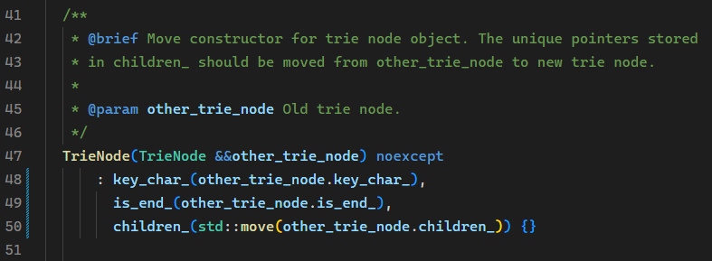
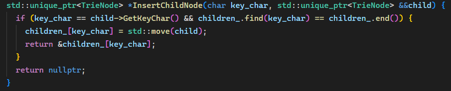
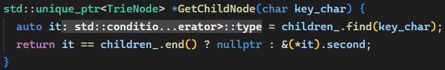
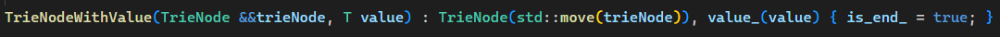
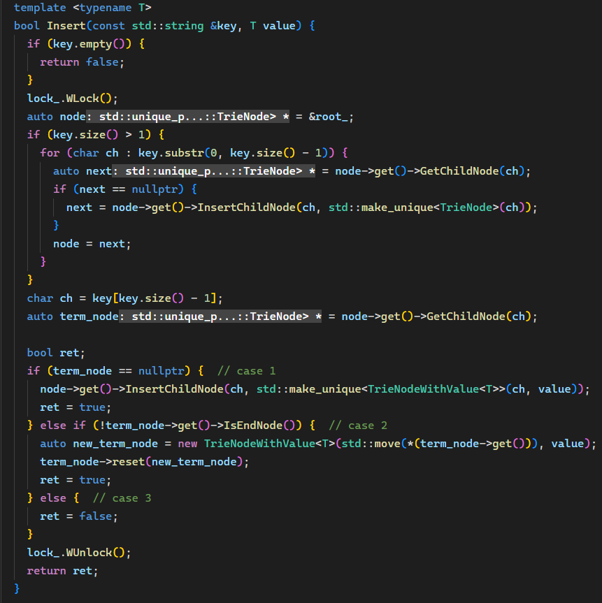
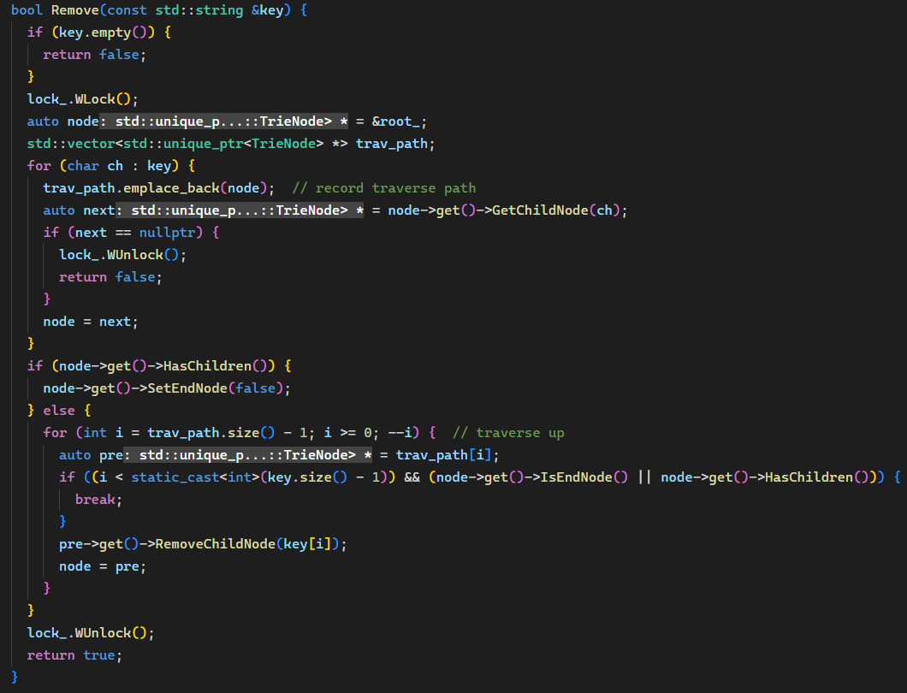
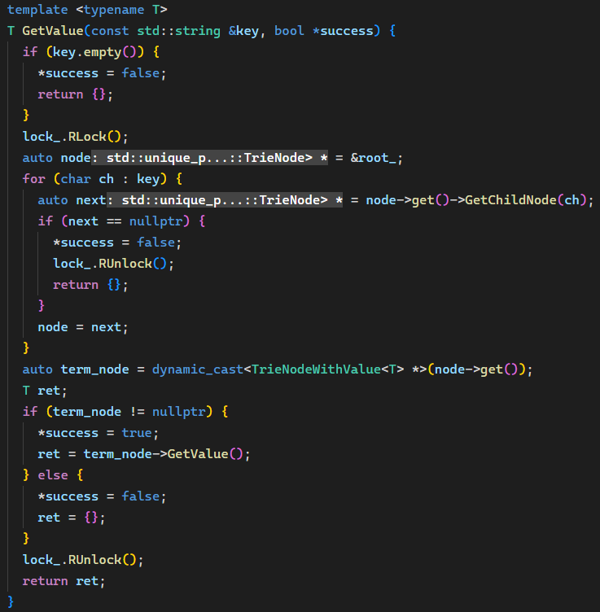

### 资源网站

###### 官方项目：https://github.com/cmu-db/bustub

###### 个人仓库：https://github.com/liujial123/test_for_15-445

###### 通关教程：https://zhuanlan.zhihu.com/p/637960746

###### *学习笔记和lab:https://blog.csdn.net/cpp_juruo/article/details/130821601

###### 搭建环境csdn：[CMU15445 fall 2022/spring 2023 项目环境搭建+选择合适的版本_15445项目-CSDN博客](https://blog.csdn.net/qq_52127701/article/details/132625376)

###### schedule:https://15445.courses.cs.cmu.edu/fall2023/

###### course:[15-445/645 (Non-CMU) Dashboard | Gradescope](https://www.gradescope.com/courses/585997)

###### 教学视频：[Caleb-ljl的个人空间-Caleb-ljl个人主页-哔哩哔哩视频](https://space.bilibili.com/353782134/favlist?fid=3288192&ftype=collect&ctype=21)

###### 中文讲课：[Caleb-ljl的个人空间-Caleb-ljl个人主页-哔哩哔哩视频](https://space.bilibili.com/353782134/favlist?fid=2543870&ftype=collect&ctype=21)

###### Github课程笔记1：[15-445-database-systems-notes/.gitignore at main · yarkhinephyo/15-445-database-systems-notes](https://github.com/yarkhinephyo/15-445-database-systems-notes/blob/main/.gitignore)

###### Github课程笔记2：[shootfirst/CMU15-445: 卡内基梅隆2021秋，2022秋数据库实验](https://github.com/shootfirst/CMU15-445)

###### 题目讲解：https://space.bilibili.com/353782134/favlist?fid=2782971&ftype=collect&ctype=21

###### 数据库讲述：https://blog.csdn.net/qq_31179577?type=blog

###### 数据库自学进阶：https://www.cs.emory.edu/~cheung/Courses/554/Syllabus/syl.html#CURRENT

###### *CMU前两个：[Altair_Alpha_-CSDN博客](https://blog.csdn.net/Altair_alpha?type=blog)

###### *CMU_P0-P4:https://blog.csdn.net/weixin_44835655?type=blog

###### cmu前两个半：[Farewell弈-CSDN博客](https://blog.csdn.net/qq_41205665?type=blog)

###### *环境配置：[CMU 15445 vscode/clion clang12 cmake环境配置 - 知乎](https://zhuanlan.zhihu.com/p/592802373)

### 准备工作

安装wsl,ubuntu,git,在vscode连接wsl，本地配置环境,参考[搭建环境csdn](https://blog.csdn.net/qq_52127701/article/details/132625376)和[教学视频](https://space.bilibili.com/353782134/favlist?fid=3288192&ftype=collect&ctype=21)

**cmake-tools-kits.json**：[Ubuntu下VsCode+CMake 交叉编译 - 责任 - 博客园](https://www.cnblogs.com/luobochn/p/10531652.html#:~:text=按Ctrl%2BShift%2BP 调出vscode 的 命令窗口%2C输入'>CMake%3AEdit,user-loacl CMake kits'.会打开一个 cmake-tools-kits.json的文件.在文件末尾添加自己的工具链信息如下%3A 保存后就可以新建一个工程了.)

## project

### P0:

#### TrieNode

需要注意的是移动构造函数（move constructor），由于 `unique_ptr` 表示独占性资源，没有拷贝构造函数，所以这里我们要用 `std::move`。`key_char_` 和 `is_end_` 是简单的内置类型（primitive type），没必要使用 move 构造。

#### InsertChildNode() 和 GetChildNode()

注意因为 `unique_ptr` 是独占性指针不能拷贝，返回值是 `unique_ptr` 的指针。

#### TrieNodeWithValue

先调用基类的构造函数，`is_end_` 是基类成员不能放在初始化列表中，放在函数体中赋值即可。

#### Trie

Trie 树的主类，这里要求实现的是增 `Insert()`、删 `Remove()`、查`(GetValue)` 三个函数。

##### Insert()

沿 Trie 树搜索到键的最后一个字符，过程中如果节点不存在就创建。对于最后一个键的字符分三种情况：

如果相应节点不存在，创建一个终结节点 TrieNodeWithValue，插入成功；
如果相应节点存在但不是终结节点（通过 is_end_ 判断），将其转化为 TrieNodeWithValue 并把值赋给该节点，该操作不破坏以该键为前缀的后续其它节点（children_ 不变），插入成功；
如果相应节点存在且是终结节点，说明该键在 Trie 树存在，规定不能覆盖已存在的值，返回插入失败。

##### Remove()

先沿 Trie 树逐字符向下搜索给定键，如果中途发现不存在直接返回 false。找到后，将该节点的 is_end_ 标为 false（此时虽然其值仍存在，但会被我们视为非终结节点）。如果该节点没有子节点，则可以删除。相应地还要向上回溯，如果其 parent 节点在移除该子节点后没有其它子节点，也删除。显然该函数可以有递归和非递归两种实现方式，我这里用非递归方式，在向下搜索时记录路径，回溯时反向遍历。因为使用智能指针，无需手动 delete 删除的 TrieNode。

##### GetValue()

沿 Trie 树查找，如果键不存在，或者节点中存储的值类型与函数调用的类型 `T` 不一致，将 `*success` 标识设为 false。类型判断的方式是使用 `dynamic_cast`。

#### 并发访问（Concurrency）

要求 Trie 树能够并发访问，因此要加锁，具体也比较简单：GetValue() 时加读锁，Insert() 和 Remove 时加写锁。项目已经提供了一个读写锁类 RWLatch，创建一个 private 成员 lock_ 放在 Trie 中，上面代码也展示了加锁解锁的操作。注意解锁要覆盖所有执行路径。

### P1:

### p2:
