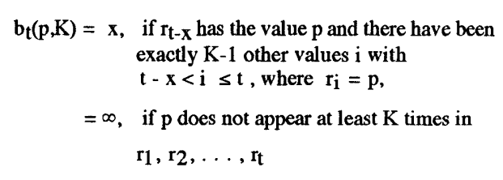
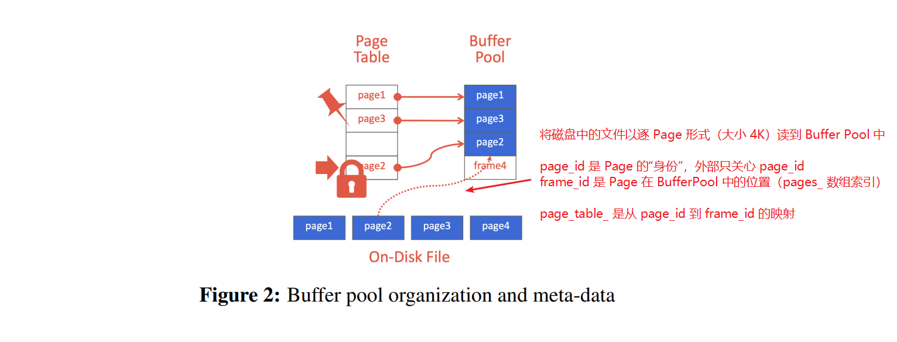

### 资源网站

###### 官方项目：https://github.com/cmu-db/bustub

###### 个人仓库：https://github.com/liujial123/test_for_15-445

###### 通关教程：https://zhuanlan.zhihu.com/p/637960746

###### *学习笔记和lab:https://blog.csdn.net/cpp_juruo/article/details/130821601

###### 搭建环境csdn：[CMU15445 fall 2022/spring 2023 项目环境搭建+选择合适的版本_15445项目-CSDN博客](https://blog.csdn.net/qq_52127701/article/details/132625376)

###### schedule:https://15445.courses.cs.cmu.edu/fall2023/

###### course:[15-445/645 (Non-CMU) Dashboard | Gradescope](https://www.gradescope.com/courses/585997)

###### 教学视频：[Caleb-ljl的个人空间-Caleb-ljl个人主页-哔哩哔哩视频](https://space.bilibili.com/353782134/favlist?fid=3288192&ftype=collect&ctype=21)

###### 中文讲课：[Caleb-ljl的个人空间-Caleb-ljl个人主页-哔哩哔哩视频](https://space.bilibili.com/353782134/favlist?fid=2543870&ftype=collect&ctype=21)

###### Github课程笔记1：[15-445-database-systems-notes/.gitignore at main · yarkhinephyo/15-445-database-systems-notes](https://github.com/yarkhinephyo/15-445-database-systems-notes/blob/main/.gitignore)

###### Github课程笔记2：[shootfirst/CMU15-445: 卡内基梅隆2021秋，2022秋数据库实验](https://github.com/shootfirst/CMU15-445)

###### 题目讲解：https://space.bilibili.com/353782134/favlist?fid=2782971&ftype=collect&ctype=21

###### 数据库讲述：https://blog.csdn.net/qq_31179577?type=blog

###### 数据库自学进阶：https://www.cs.emory.edu/~cheung/Courses/554/Syllabus/syl.html#CURRENT

###### *CMU前两个：[Altair_Alpha_-CSDN博客](https://blog.csdn.net/Altair_alpha?type=blog)

###### *CMU_P0-P4:https://blog.csdn.net/weixin_44835655?type=blog

###### cmu前两个半：[Farewell弈-CSDN博客](https://blog.csdn.net/qq_41205665?type=blog)

###### *环境配置：[CMU 15445 vscode/clion clang12 cmake环境配置 - 知乎](https://zhuanlan.zhihu.com/p/592802373)

### 准备工作

安装wsl,ubuntu,git,在vscode连接wsl，本地配置环境,参考[搭建环境csdn](https://blog.csdn.net/qq_52127701/article/details/132625376)和[教学视频](https://space.bilibili.com/353782134/favlist?fid=3288192&ftype=collect&ctype=21)

**cmake-tools-kits.json**：[Ubuntu下VsCode+CMake 交叉编译 - 责任 - 博客园](https://www.cnblogs.com/luobochn/p/10531652.html#:~:text=按Ctrl%2BShift%2BP 调出vscode 的 命令窗口%2C输入'>CMake%3AEdit,user-loacl CMake kits'.会打开一个 cmake-tools-kits.json的文件.在文件末尾添加自己的工具链信息如下%3A 保存后就可以新建一个工程了.)

## project

### P0:

#### TrieNode

需要注意的是移动构造函数（move constructor），由于 `unique_ptr` 表示独占性资源，没有拷贝构造函数，所以这里我们要用 `std::move`。`key_char_` 和 `is_end_` 是简单的内置类型（primitive type），没必要使用 move 构造。

#### InsertChildNode() 和 GetChildNode()

注意因为 `unique_ptr` 是独占性指针不能拷贝，返回值是 `unique_ptr` 的指针。

#### TrieNodeWithValue

先调用基类的构造函数，`is_end_` 是基类成员不能放在初始化列表中，放在函数体中赋值即可。

#### Trie

Trie 树的主类，这里要求实现的是增 `Insert()`、删 `Remove()`、查`(GetValue)` 三个函数。

##### Insert()

沿 Trie 树搜索到键的最后一个字符，过程中如果节点不存在就创建。对于最后一个键的字符分三种情况：

如果相应节点不存在，创建一个终结节点 TrieNodeWithValue，插入成功；
如果相应节点存在但不是终结节点（通过 is_end_ 判断），将其转化为 TrieNodeWithValue 并把值赋给该节点，该操作不破坏以该键为前缀的后续其它节点（children_ 不变），插入成功；
如果相应节点存在且是终结节点，说明该键在 Trie 树存在，规定不能覆盖已存在的值，返回插入失败。

##### Remove()

先沿 Trie 树逐字符向下搜索给定键，如果中途发现不存在直接返回 false。找到后，将该节点的 is_end_ 标为 false（此时虽然其值仍存在，但会被我们视为非终结节点）。如果该节点没有子节点，则可以删除。相应地还要向上回溯，如果其 parent 节点在移除该子节点后没有其它子节点，也删除。显然该函数可以有递归和非递归两种实现方式，我这里用非递归方式，在向下搜索时记录路径，回溯时反向遍历。因为使用智能指针，无需手动 delete 删除的 TrieNode。

##### GetValue()

沿 Trie 树查找，如果键不存在，或者节点中存储的值类型与函数调用的类型 `T` 不一致，将 `*success` 标识设为 false。类型判断的方式是使用 `dynamic_cast`。

#### 并发访问（Concurrency）

要求 Trie 树能够并发访问，因此要加锁，具体也比较简单：GetValue() 时加读锁，Insert() 和 Remove 时加写锁。项目已经提供了一个读写锁类 RWLatch，创建一个 private 成员 lock_ 放在 Trie 中，上面代码也展示了加锁解锁的操作。注意解锁要覆盖所有执行路径。

### P1:

#### **Extendible Hash Table 可扩展哈希表**

拉链法实现的哈希表当某个哈希值对应的（即存在于同一个“桶”中，Bucket）元素特别多时，查找的时间复杂度由 O ( 1 ) O(1)O(1) 退化为遍历的 O ( n ) O(n)O(n)。举个极端的例子，如果哈希函数是不管输入是什么都映射为 0，那么就和在第 0 位存储一个链表无异。如何设计散布更加均匀的哈希函数是优化的另一个方向，而另一种方法是当检测到某个桶中的元素过多时对表进行扩展。扩展最简单的做法是直接将哈希表的长度（桶数）翻倍，再将哈希函数的值域由 [ 0 , n ) [0, n)[0,n) 改为 [ 0 , 2 n ) [0, 2n)[0,2n)（这点很容易实现，因为大部分哈希函数本身就是先算出某个值，然后对 n nn 取余数），然后对所有存储的元素重新算一次哈希值分布到不同的桶中。

这种方法的缺点很明显：如果哈希表中已经存储了大量的元素，因为要对所有元素重算哈希值，扩展的过程会有巨大的计算量，导致一次突发的大延迟。实际上，进行扩展时，可能仅仅是某一个桶出现了拉链很长的状况，其它桶的余量还很充足。于是，出现了可扩展哈希表（Extendible Hash Table）的方案，其将哈希得到的下标与桶改为非一对一映射，并引入全局深度（Global Depth）和局部深度（Local Depth）的概念，实现扩展时只需对达到容量的那一个桶进行分裂，解决了以上问题。

#### **LRU-K 置换**

LRU 置换大家应该都很熟悉了，如果不了解可以刷一下 LeetCode 这道题。其存在的一个问题是，如果突然出现一个很长的一次性顺序访问序列到来，就会把有用的 Cache 全冲掉，也就是缓存污染问题。例如 Cache 容量是 3，存有较常访问的 [A，B，C]，此时有一个访问序列 D，E，F 到来，就会把 ABC 全踢掉，即使 DEF 以后可能再也不会出现。

LRU-K 替换策略，一句话总结就是永远优先踢掉没有达到 K 次访问的元素，否则对于已经达到 K 次访问的元素按照 LRU 踢出。原始论文给出了一个 Backward K-distance 的概念如下：

可见对于没有访问至少 K 次的元素，其距离为正无穷，所以会被优先踢出。当存在多个这样的元素时，原论文指出可采用某种二级策略。本实验材料提示此时我们应踢出访问记录最早的元素，也就是采用 FIFO 而非 LRU。

实现上，网上有很多材料给出了方法，即维护一个访问历史队列（记录未达到 K 次访问的元素）和一个缓存队列（记录达到 K 次访问的元素）。当某元素访问达到 K 次时，由历史队列移到缓存队列中。置换时，如果历史队列不为空，就从历史队列踢，否则从缓存队列踢。缓存队列要按 LRU，所以后续再访问某元素时要移到队头；而历史队列采用 FIFO，所以有重复元素访问时不用移动。

注意这里只是概念上为了决定踢出哪个元素而设计了两个队列的结构，实际上每个元素第一次到来时如果 cache 有空位也会放进去。

#### **Buffer Pool Manager**

Buffer Pool 的具体概念，简单来说就是充当数据库上层设施和磁盘文件间的缓冲区，类似于 Cache 在 CPU 和内存间的作用。bustub 中有 Page 和 Frame 的概念，Page 是承载 4K 大小数据的类，可以通过 DiskManager 从磁盘文件中读写，带有 page_id 编号，is_dirty 标识等信息。Frame 不是一个具体的类，而可以理解为 Buffer Pool Manager（以下简称 BPM）中容纳 Page 的槽位，具体来说，BPM 中有一个 Page 数组，frame_id 就是某个 Page 在该数组中的下标。

外界只知道 page_id，向 BPM 查询时，BPM 要确定该 Page 是否存在以及其位置，所以要维护一个 page_id 到 frame_id 的映射，其实现就使用我们刚完成的 ExtendibleHashTable。为区分空闲和占用的 Page，维护一个 free_list_，保存空闲的 frame_id。初始状态，所有 Page 都是空闲的。当上层需要取一个 Page 时，如果 Page 已存在于 BP 中，则直接返回；否则需要从磁盘读取到 BP 中。此时优先取空闲的 Page，否则只能从所有已经占用的 Page 中用我们刚完成的 LRUKReplacer 决定踢出某个 Page。

### p2:

#### Task #1：B+ Tree Pages

##### B+ Tree Parent Page

没什么可说的，都是些辅助函数，但是可以从结构上明确下，方便后面的设计。

虽然上一个实验已经接触到了Page，但是也就是通过page_id索引对应的Page而已，不需要关注Page的内容。实际上，Page中的相关变量如下：

~~~ 
/** The actual data that is stored within a page. */
char data_[BUSTUB_PAGE_SIZE]{};
/** The ID of this page. */
page_id_t page_id_ = INVALID_PAGE_ID;
/** The pin count of this page. */
int pin_count_ = 0;
/** True if the page is dirty, i.e. it is different from its corresponding page on disk. */
bool is_dirty_ = false;
/** Page latch. */
ReaderWriterLatch rwlatch_;
其中存储了 BUSTUB_PAGE_SIZE = 4096(Bytes)大小的数据，剩余成员变量即一些相关信息，可以称为metadate，即元数据。
~~~

而B_PLUS_TREE_PAGE则存储了24Bytes的相关信息，可以理解为通用的头信息，如下所示：

~~~
IndexPageType page_type_;   // leaf or internal. 4 Byte
lsn_t lsn_  // temporarily unused. 4 Byte
int size_;  // tree page data size(not in byte, in count). 4 Byte
int max_size_;  // tree page data max size(not in byte, in count). 4 Byte
page_id_t parent_page_id_; // 4 Byte
page_id_t page_id_; // 4 Byte
~~~

通过引用的头文件

~~~ 
#include "buffer/buffer_pool_manager.h"可以看出，在本项目中会通过上一个Pro中实现的Buffer Pool来管理Page。
~~~

**此处我有一个疑问，B+树中的头信息，会占据Page 原本用于存放数据的空间吗？**

##### B+ Tree Internal Page

Internal Page，每个Page中存储的是 N 个索引以及 N+1 个指向子树的指针

从本实验开始，难度逐渐加大，一个重要原因就在于本实验只提供了一些最基础的API，剩余的API都需要自己设计。

此处仍需要先明确一下，我们实现的B+树是一种模板编程，bustub中提供的索引模板参数定义如下：

~~~ 
#define INDEX_TEMPLATE_ARGUMENTS template <typename KeyType, typename ValueType, typename KeyComparator>
~~~

我们要根据Key值来找到对应的索引位置，即K(i) <= K < K(i+1)，而KeyComparator则是提供了一种比较Key值的手段，因为KeyType不一定是可以直接比较大小的类型。

而映射类型则为：

~~~
#define MappingType std::pair<KeyType, ValueType>
~~~

根据代码中，对于INTERNAL_PAGE_SIZE的定义，一个Page的结构如下图所示，此处也回答了我此前的疑问，Page中原本用于存储键值对的内存空间，分出了24Bytes给B+树节点的头信息。

代码中最怪的地方，应当在于私有变量仅有一个：

~~~
// Flexible array member for page data.
MappingType array_[1];
~~~

从表面上我们可以看出，这是一个大小为1的数组，元素为键值对，按理来说，知道内部页可用于存放数据的空间大小和键值对的大小，就可以计算出有多少键值对可以放入一个Page中，但定义只有一个元素显然不合理。

经查询相关博客与询问GPT之后，明白了为什么要这么做的原因：

[做个数据库：2022 CMU15-445 Project2 B+Tree Index - 知乎 (zhihu.com)](https://zhuanlan.zhihu.com/p/580014163)

GPT将Flexible array翻译为柔性数组，必须要放在结构体的最后，用以占用结构体中剩余的未被定义的内存空间，即该数组可以实现动态扩张，内部页的内存结构如下：

~~~
博客中提到了一点，即内存对齐问题，因为头信息中的所有数据都是4Bytes，而在同一棵树中，每一个键值对的大小也是固定的，是满足内存对齐的条件的。我稍微想了一下，如果有一个头信息占用的空间过大，会导致数据空间以该变量的大小来决定，键值对儿则未必能满足对齐条件。只要键值对类型的占用空间 ≥ 4Bytes，或者是 4Bytes = 整数倍的键值对大小，理应都是可以满足对齐条件的。这也正好给内存对齐提供了一个实例。
~~~

而指导中也提出了一点，第一个key的位置是不存放数据的，因此内部页的逻辑结构则如下面两张图所示：

本Task需要完成的API有如下几个：

~~~ 
void Init(page_id_t page_id, page_id_t parent_id = INVALID_PAGE_ID, int max_size = INTERNAL_PAGE_SIZE);

auto KeyAt(int index) const -> KeyType;
void SetKeyAt(int index, const KeyType &key);
auto ValueAt(int index) const -> ValueType;
~~~

仍是一些辅助函数，实现起来并不困难。

##### B+ Tree Leaf Page

叶子页的内部结构和内部页是近似的，无非是value部分存储的是数据，而且多了一个变量next_page_id_指向下一个Page的ID。

其逻辑结构如下所示：

指导书中也点明了叶子页中value should only be 64-bit record_id that is used to locate where actual tuples are stored, see RID class defined under in src/include/common/rid.h. 在这里只需要理解值是RID就可以了，更深刻一点可以理解为二级索引指向具体数据的指针，因为RID就是个64位的整数。

叶子页需要实现的API则如下所示：

~~~
void Init(page_id_t page_id, page_id_t parent_id = INVALID_PAGE_ID, int max_size = LEAF_PAGE_SIZE);
// helper methods
auto GetNextPageId() const -> page_id_t;
void SetNextPageId(page_id_t next_page_id);
auto KeyAt(int index) const -> KeyType;
~~~

仍是一些辅助函数，实现起来也不困难。

另外，指导书中也说明了，无论是内部页还是叶子页，都需要通过page_id获取缓冲池中内存页的数据内容，通过reinteroret cast转换成为内部页/叶子页。

**此处不理解为什么要使用不安全的reinteroret cast（该强制类型转换用于转化指针和引用，但并不进行数据类型检查，因此不安全）。**

**补充**
通过实例化的模板类可以看出，无论是内部页还是叶子页（以叶子页为例），其KeyValue = GenericKey，KeyComparator = GenericComparator，而通过这两个类的说明可知：

- GenericKey使用一个固定长度的数组来保存用于索引的数据，其实际大小是通过模板参数指定和实例化的；其中提供了一个仅用于测试时的函数ToString()，可以将key强转为int_64类型。

- GenericComparator的比较规则是 左值 < 右值，返回 -1， 左值 > 右值，返回 1，如果两者相等，则返回0。

#### Task #2：B+ Tree Data Structure（Insertion，Deletion，Point Search）

任务2应当是本节的重点。而且官方还提供了第一个CheckPoint，只需要完成插入，删除以及点查询三个功能即可.

下面这个网站可以实现B+树的可视化：

[B+ Tree Visualization (usfca.edu)](https://www.cs.usfca.edu/~galles/visualization/BPlusTree.html)

指导书中提到了几个点：

- B+树仅支持唯一索引，所以插入时，需要判断key是否存在，存在即返回false；且插入触发拆分条件（叶节点插入后的键/值对数等于 max_size ，内部节点插入前的子节点数等于 max_size ）时，则应正确执行拆分。

- 删除时，需要考虑当前页中元素数量小于阈值（内部页是max + 1 的一半，叶子页是一半），即需要考虑借元素或者合并操作。

- 以下为指导书中的原话：

~~~
由于任何写入操作都可能导致 B+Tree 索引中的 root_page_id 发生变化，因此您有责任更新标题页 ( src/include/storage/page/header_page.h ) 中的 root_page_id 。这是为了确保索引在磁盘上是持久的。在 src/include/storage/index/b_plus_tree.h的BPlusTree 类中，已经实现了一个名为 UpdateRootPageId 的函数；需要做的就是在 B+Tree 索引的 root_page_id 发生变化时调用此函数。
~~~

本实验的相关API就需要自己实现了。而指定的GetValue()、Insert()和Delete()函数都是在b_plus_tree.cpp中实现的。

##### GetValue()

首先应当找到目标叶子节点，可以将搜索过程集成在FindLeaf()函数中，无论是在纯查询，还是插入或是删除，都用得着。搜寻要从根节点开始搜索：

- 在内部页中搜索，直到找到叶子页为止。

- 记住内部页中第一个key是不存在的，遍历方式采用二分查找即可（当然也有其他的实现方式）。找到第一个大于key的节点，返回前一个节点的value，即指向子树的指针；如果key相同，就说明找到了。

- 在叶子页中搜索，同样采用二分查找，将最终结果保存在形参的vector中。

此处需要注意，查找page需要借由Buffer Pool Manager来实现，即调用FetchPage()，当已经找到最终的value时，记得unpin叶子节点，否则运行过程中有可能出现Buffer Pool中的所有页都被pin住，无法加载新页进内存。

##### Insert()

先说一种特殊情况，即B+树为空，需要创建一个新的页作为根节点，此时根节点也是叶子。与根节点相关时，指导书中原话如下：

~~~
Since any write operation could lead to the change of root_page_id in B+Tree index, it is your responsibility to update root_page_id in the header page (src/include/storage/page/header_page.h). This is to ensure that the index is durable on disk. Within the BPlusTree class, we have already implemented a function called UpdateRootPageId for you; all you need to do is invoke this function whenever the root_page_id of B+Tree index changes.
~~~

即涉及到根节点的数据更新时，需要调用UpdateRootPageId()函数;

剩余的情况大体可以分三种，首先第一步都是在树中找对应的节点：

- 如果树中已存在key，则返回false，因为本Pro中仅讨论唯一索引；
- 如果是叶子节点，插入后：
	- 如果页中元素个数<= m - 1，结束；
	- 反之，元素个数> m - 1，则当前节点分裂为左右两个节点，前m/2个元素置于左节点，剩余的置于右节点，第m/2 + 1个元素上移至父节点中，其左Value指向左节点，右Value指向右节点。
- 如果是内部节点，插入后：
	- 如果页中元素个数<= m - 1，结束；
	- 反之，元素个数> m - 1，则当前节点分裂为左右两个节点，前(m-1)/2个元素置于左节点，后面的m-(m-1)/2个元素置于右节点，第m/2个元素上移至父节点中，其左Value指向左节点，右Value指向右节点，并继续判断父节点是否需要分裂。

~~~
Q：为什么内部页分裂的时候需要考虑传入Buffer Pool Manger呢？而叶子页分裂时不需要？

A：为了修改赋值后键值对子树的父节点的page_id，所以要取出分裂后页中每个键值对指向的子树页。
~~~

##### Delete() => Remove()

B+树删除的逻辑是有一张经典的伪代码图做解释的（可自行查询），相比较插入的逻辑，删除的逻辑大体上相当于是个逆过程，但是要考虑的情况却要多不少，难点就在于借节点和合并以保持B+树的结构上。大体逻辑如下：

- 树为空或者没有找到待删除的元素，直接返回

- 如果是叶子页

	- 如果页中元素个数大于“一半”（此处至向上取整的最大值的一半 - 1，以5为例，就是 3 - 1 = 2），树的结构不会发生变化，直接返回即可

	- 反之，有两种情况：
		- 若兄弟页（特指父页相同的兄弟页）的元素数量多于一半，则从中借一个元素：如果是左兄弟就搬最后一个元素到起始；如果是右兄弟就搬第一个元素到末尾。同时，用该节点替换父节点中的元素。
		- 反之，就要考虑将两个页进行合并操作，可以把源节点复制到兄弟节点里，也可以相反，但是要注意父节点中对应Value的删除，和page_id的更新。

- 如果是内部页
	- 如果页中元素大于一半，则无需操作，直接结束即可
	- 反之，和叶子页的逻辑一致，需要考虑的一个问题就是如果根页是内部页中仅剩下一个元素即只存在一个child的时候，就需要把这个child上升为根节点。另一种情况就是既是根又是叶子页的时候，直接就把元素删光了，也不是没可能的。

另外有一个很容易忽略的点，即合并两个页之后，是有一个page_id是要被删除的。你会发现已提供的API中存在一个参数为transaction即事务，其中提供了一个名为AddIntoDeletedPageSet的API，便是用于做这件事的：把那些待删除的的Page加入deleted_page_set_中，在删除操作的末尾，后续统一处理（可以采用遍历迭代器的方式进行删除）。

在提交前勿忘记检查一遍格式：

~~~
$ make format
$ make check-lint
$ make check-clang-tidy-p1
~~~

#### Task #3：Index Iterator

将叶子页迭代器化，近似于组织为链表（MySQL中就是如此），迭代器应当具有基本功能，例如运算符和for-each循环。

迭代器的操作仅需在src/include/storage/index/index_iterator.h和src/index/storage/index_iterator.cpp中进行实现。

指导书中提供了以下几个成员函数，可以自行实现其他辅助函数

- **isEnd()** ：返回此迭代器是否指向最后一个键/值对。

- **operator++()** ：移至下一个键/值对。注意，形参为空的是前置++。

- **operator*()** ：返回该迭代器当前指向的键/值对。

- **operator==()** ：返回两个迭代器是否相等

- **operator!=()** ：返回两个迭代器是否不相等。

首先明确，迭代器中的元素应当为某个叶子页中的某元素，因此必然需要包含一个叶子页和当前叶子中的索引作为成员变量，以及为了能够在不同叶子页之间做到切换，也自然要把BufferPoolManager考虑进去，在发生切换时要记得Unpin前一个page。

本Task总体来说并不困难，相较于实现基础的B+树来说，就是做了一层封装。

但是实现完index_iterator中的内容后，不要忘记B+树中也是有对应的实现的（目的就是为了在B+树中使用）：

区别在于返回类型为迭代器类型。

#### Task #4：Concurrent Index

直接加一把大锁不是不可以，但是实验的初衷并非如此，由于项目中已经提供了页的锁，所以本Task的难点在于，何时、何处考虑加锁与解锁！

此处提供一篇详细讲述Task4的文章：

[CMU 15445-2022 P2 B+Tree Concurrent Control - 知乎 (zhihu.com)](https://zhuanlan.zhihu.com/p/593214033)

指导书中点明了一种名为latch crabbing的技术，基本思想是，遍历B+树的线程会在B+树页面上获取和释放锁（latch）。线程只能在子页面被认为是"安全的"时才能释放父页面上的锁。这里的"安全"的定义可以根据线程执行的具体操作而有所变化。在具体实现上，当一个线程需要访问一个页面时，它会首先获取该页面的锁。然后，线程会向上遍历树，逐级获取每个父页面的锁，直到达到根页面。在获取父页面的锁之前，线程需要判断其子页面是否被认为是"安全的"，如果是，则可以释放子页面的锁，并继续向上获取父页面的锁。这种锁的获取和释放过程就像螃蟹在爬行时借助爪子一样，因此称为"latch crabbing"。

而“安全”的定义则是：节点在进行操作后，不会触发分裂或合并，影响父节点的指针。对插入操作，leafpage和internalpage的安全性应该分情况考虑，因为它们分裂的时机不同。对删除操作，节点要比minsize大。

这篇文章中还提到了一种测试多线程偶然出错的方式：

~~~
while xxxx/build/test/b_plus_tree_concurrent_test ; do echo 1; done;
~~~

指导书中对于加锁进行了简要的描述：

- **Search** ：从根页开始，抓住子页上的读（R）闩锁，然后在到达子页时立即释放父页上的闩锁。由于查询的性质是读，读锁是共享的。

- **Insert** ：从根页开始，抓住子页的写（W）锁存器。一旦子页被锁住，检查它是否安全，在这种情况下，不安全。如果子页安全，则释放对祖先的所有锁定。

- **Delete** ：从根页开始，抓住子页的写（W）锁存器。一旦子页被锁上，检查它是否安全，在这种情况下，至少是半满的。 （注意：对于根页，我们需要使用不同的标准进行检查）如果子页是安全的，则释放祖先上的所有锁。

有以下几个小点需要注意：

- 有关锁的实现在src/include/common/rwlatch.h下。

- 
	此前几乎没怎么被用到的transaction中也提供了遍历树时存储已获取的父节点锁的方法。

- 要在Page上加锁，而非在节点上。

- 需要在Leaf Page无法获取到兄弟页的锁时抛出异常以避免潜在的死锁。

- 保护root_page_id在插入与删除时不会被并发更新（提示是使用std::mutex）

无论是查找、插入还是删除，都需要通过FindLeaf函数找到对应的叶子页或者是对应的页，加锁的重点就在这个函数中实现

- 如果是查找，FindLeaf时，每一次向下遍历都需要给子页加读锁，同时释放父页的读锁即可

- 如果是插入，需要给遍历到的页加写锁，如果最终叶子页是安全的，既可以释放所有祖先的写锁

- 如果是删除，与插入同理

在插入和删除的过程中，需要注意的是何时释放锁。

对于插入而言，有两个需要注意的点：

- 如果造成分裂，此时待整个分裂过程完成前，叶子页和祖先的写锁是都不能被释放的，因为分裂时兄弟页的首索引需要上移至父页，父页也是有可能发生分裂的。

- 当插入操作完成时，需要释放叶子页中的锁以及祖先上的所有锁

而对于移除而言，需要额外多提一个点：

- 由于移除时涉及到借兄弟页元素的操作，因此也要记得给兄弟页加锁并且用完后即使释放。

测试记录

本地错误：b_plus_tree_insert_test 段错误

经测试，问题发生在如下代码段：

~~~
std::vector<int64_t> keys = {1, 2, 3, 4, 5};
  for (auto key : keys) {
    int64_t value = key & 0xFFFFFFFF;
    rid.Set(static_cast<int32_t>(key >> 32), value);
    index_key.SetFromInteger(key);
    tree.Insert(index_key, rid, transaction);
~~~

当进行到第四次插入时，会发生错误如下：

~~~
Signal: SIGSEGV (Segmentation fault)
~~~

经定位，问题最终发生在**InsertIntoParent**函数的调用上，由于CheckPoint #1无需考虑transaction的问题，而InsertIntoParent本质上是一个递归的过程，在内部递归的该函数调用上缺少了transaction参量。

虽然这个问题看上去是一次疏忽，但是在排查过程中，也发现了另一个问题，即插入引起分裂后

本地错误：并发测试中的DeleteTest1未通过
当我把测试中的线程数改为1，就可以通过测试，说明问题确实发生在并发性上而非别的原因。

线上错误：
说实在的，没想到本地的测试通过后，线上依旧有这么多bug。唯一通过的测试案例是DeleteTest3。

看了一下输出的log，问题多在想要得到的值与实际得到的值不匹配，相比此前提交的一次多数超时的情况，已经好了很多了（此问题的起因源于IndexIterator在析构的时候，没有Unpin，主要也是因为我写完Task3之后，没有做insert和delete的本地测试）。

从头到尾检查了一番之后，发现出现了死锁问题：

问题可能发生在页的类型上，改日再进行排查。

编译指令&本地测试：

~~~
make b_plus_tree_insert_test -j4
make b_plus_tree_delete_test -j4
make b_plus_tree_contention_test -j4
make b_plus_tree_concurrent_test -j4

./test/b_plus_tree_insert_test
./test/b_plus_tree_delete_test
./test/b_plus_tree_contention_test
./test/b_plus_tree_concurrent_test
~~~

